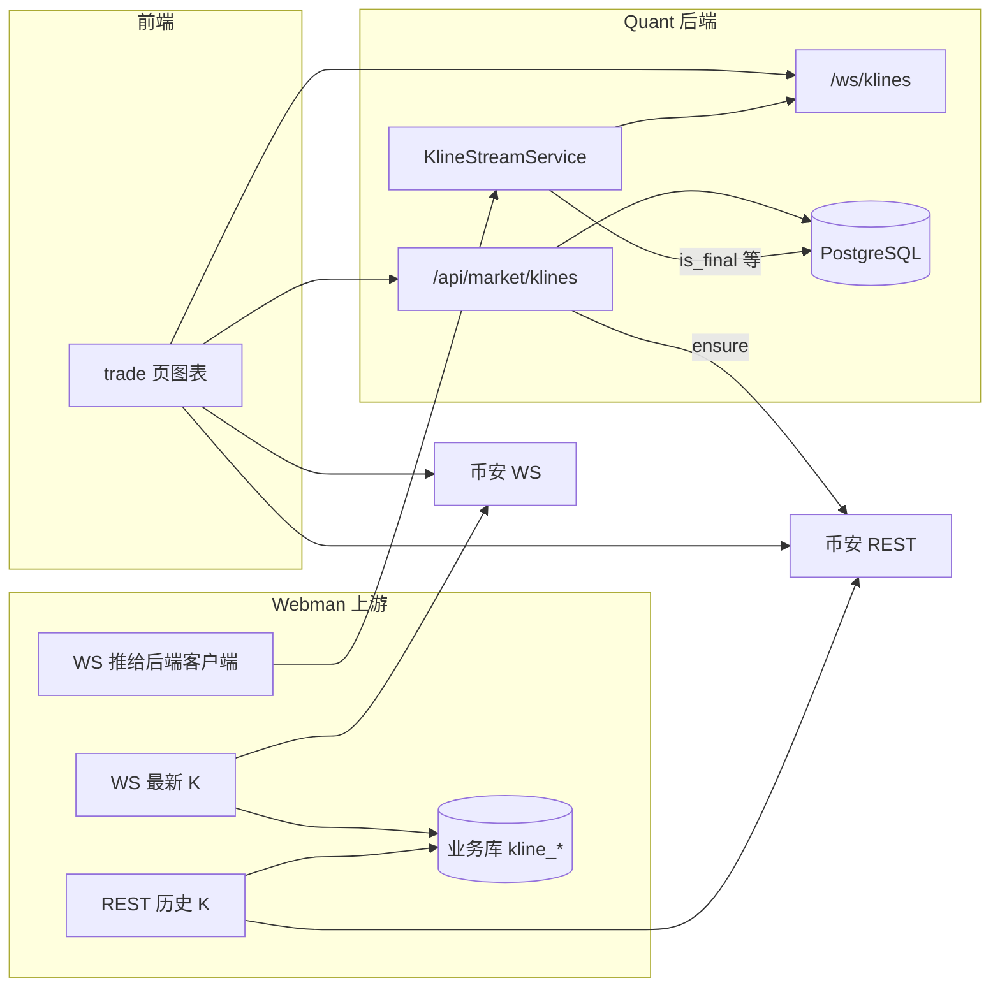

# K 线体系架构、Webman 上游与演进路线

本文档描述 **Quant** 仓库内 **前端 / 后端 / 外部上游（Webman）** 的职责划分、数据流、对接约定，以及已知问题与后续优化（含「向左无限加载历史 K」）。与业务表结构说明仍见 `docs/models.py`、`docs/DEVELOPMENT.md`。

---

## 1. 三方职责一览

| 组件 | 技术栈 / 位置 | 职责 |
|------|-----------------|------|
| **上游采集** | **Webman**（独立进程/项目，不在本仓库） | 通过 **HTTP** 拉取币安历史 K 线并入库；通过 **WebSocket** 订阅币安最新 K 线并 **入库**；向 **本后端** 已连接的客户端推送与 `KlineStreamService` 兼容的 **JSON K 线消息**（见 §4）。 |
| **后端 API** | FastAPI：`backend/` | `GET /api/market/klines`：读库 + 可选 `ensure` 时走 **币安 REST** 同步补数；WebSocket `WS /ws/klines`：按组广播 `kline_snapshot` / `kline_stream`；`KlineStreamService` 作为 **上游 WS 的客户端**（默认 `KLINE_UPSTREAM_WS_URL`，如 `ws://127.0.0.1:8383`）。 |
| **前端** | Next.js：`frontend/app/trade/page.tsx` | HTTP 拉历史；连后端 `/ws/klines`；可 **直连币安** REST/WS 做行情展示与最后一根 K 的实时修正。 |

---

## 2. 数据流（逻辑）



说明：

- **Webman** 与 **Quant** 可共用同一套 **PostgreSQL**（表名 `kline_1m` … `kline_4h` 等与 `kline_repo.INTERVAL_TABLE` 一致），则 `ensure` 与读库结果与上游写入一致。
- **Quant** 内 **`KlineStreamService`** 不直接连币安；它连的是 **`KLINE_UPSTREAM_WS_URL`**，预期由 **Webman（或其它服务）** 提供与 §4 一致的推送协议，再转发给浏览器。

---

## 3. 后端关键点（便于对齐 Webman）

- **环境变量**（`backend/app/settings.py`）  
  - `KLINE_UPSTREAM_WS_URL`：上游 WebSocket 地址（Webman 监听端口需与此一致）。  
  - `KLINE_SYMBOLS`、`KLINE_INTERVALS`：后端 **允许订阅 / 转发** 的符号与周期（与 Webman 侧配置建议保持一致）。  
  - `KLINE_BUFFER_SIZE`：内存缓冲条数，影响初始快照长度与 `prune_old_klines` 的 `keep` 量级。
- **REST 写库**（`ensure=true`）：`sync_symbol_interval` → 币安 `fapi/v1/klines` → `upsert_klines`。与 Webman 入库为 **并行写库路径**，需注意 **幂等**（按 `symbol + open_time` upsert）与 **保留策略**（见 §6）。
- **仅收盘落库**：上游经 `KlineStreamService` 转发的 K，`is_final == true` 时才会 `upsert_klines` + `prune_old_klines` + 震荡引擎（见 `kline_stream_service.py`）。

---

## 4. Webman → Quant 上游 WebSocket 契约

后端连接上游后会 **主动发送**（见 `_upstream_loop`）：

```json
{
  "type": "subscribe_kline",
  "symbols": ["BTCUSDT", "..."],
  "intervals": ["1m", "5m", "..."]
}
```

上游应推送 **`type` 为 `kline_stream` 或 `kline_sync`** 的 JSON，`symbol`、`interval` 须在 `settings` 允许的集合内；`data` 需能被 `_parse_upstream_candle` 解析，例如：

- 优先：`open_time_ms` / `close_time_ms`（毫秒）、`open`/`high`/`low`/`close`、`volume` 等、`is_final`（布尔）。
- 或：`open_time` / `close_time` 字符串（可被 `strptime` / `fromisoformat` 解析）。

转发给浏览器时，后端会统一成带 `boll_*` 等的 `kline_stream` 负载（与 `trade` 页消费结构一致）。

---

## 5. 前端实时行情说明（与「K 线是否跟着价跳」）

交易页同时使用：

1. **后端** `WS_BASE/ws/klines`（受 `binanceKlineLiveRef` 影响：直连币安 K 线成功时会 **忽略** 后端 `kline_stream`，避免旧包覆盖最后一根）。  
2. **直连币安**：K 线：`wss://<host>/market/ws/<symbol>@kline_<interval>`；成交：建议使用 **`wss://<host>/market/ws/<symbol>@aggTrade`**（官方 Market 路径，字段 `e` 为 `aggTrade`），逐笔修正最后一根 OHLC。

若 **仅「最新价」文字在变、蜡烛不动**，常见原因：

| 现象 | 可能原因 |
|------|----------|
| 最新价来自轮询 `ticker/price`，K 不动 | 成交 WS 未收到 `trade`/`aggTrade`，或仍使用已废弃/无数据的 `@trade` 旧路径。 |
| BINANCE K 显示已连接但无 `kline` | K 线 URL 未使用 `/market/ws/`；或网络/代理只放行部分域名。 |
| 有历史但 `lastCandleRef` 未初始化 | 首屏 HTTP 失败且 K 线流未到；需保证 `/api/market/klines` 或 REST 合并成功。 |
| 后端有流、图表仍不动 | 直连币安 K 为 true 时后端 `kline_stream` 被跳过，仅依赖币安 K；上游 Webman 只影响经 FastAPI 转发的路径。 |

**建议**：在 Webman 保证入库与推送频率的同时，前端以 **Market 路径的 `@kline_*` + `@aggTrade`** 为准做展示兜底；生产环境再逐步收口为「单源」。

---

## 6. 深度历史与「向左无限加载」

当前限制：

- `prune_old_klines` 按 `keep`（与 buffer/limit 同量级，如 1500）裁剪，**库内只有有限窗口**，不是真正意义上的全历史。

建议路线：

1. **存储**：提高 `keep`、按时间分区表、或冷归档；超出部分 **按需** 调币安 REST（`endTime`）回填。  
2. **API**：新增例如 `GET /api/market/klines/before?symbol=&interval=&before_open_time_ms=&limit=`，`open_time < before` 分页升序返回。  
3. **前端**：`timeScale.subscribeVisibleTimeRangeChange`（或 v5 等价 API），接近左边界时请求上一页，`setData` 合并去重并尽量保持视口。  
4. **布林线**：全量重算开销大，建议仅对可见区 ± 窗口计算或由后端/上游返回指标。

---

## 7. 系统优化建议（摘要）

- **单一可信实时源**：理清「Webman 推后端 → 前端只连 FastAPI」与「前端直连币安」的组合策略，避免双源互相覆盖。  
- **上游 WS**：Webman 侧重连、限流、监控；后端 `try_send` 队列满时会丢消息，重要场景需指标或降级策略。  
- **震荡引擎**：`is_final` 触发全量回算在数据量大时成本高，可评估增量或节流。  
- **文档与运维**：在部署清单中写明 Webman 地址、`KLINE_UPSTREAM_WS_URL`、库表与 `KLINE_SYMBOLS` 对齐情况。

---

## 8. 文档维护

- 表结构、震荡业务语义仍以 `docs/models.py`、`DEVELOPMENT.md` 为准。  
- 若 Webman 推送字段有扩展，请同步更新 §4 与 `kline_stream_service._parse_upstream_candle` 的兼容逻辑。
