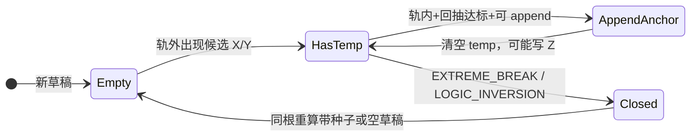

# 震荡结构体（X-Y-Z）识别 — 开发文档

> **目标读者**：用 Trae / Cursor 实现或对齐「震荡结构识别」的开发者。  
> **范围**：从 K 线输入到 `oscillation_structures` 落库的规则、状态机、字段约定与验收标准。  
> **规范来源**：业务语义见 [`docs/1.txt`](1.txt) 第二节；**实现以本仓库 `app/services/oscillation_service.py` 为准**（与 1.txt 中个别比例文字可能不一致时，以代码与 `.env` 配置为准）。

---

## 一、业务目标

在单一交易对、单一周期上，按时间顺序扫描带布林与关键点的 K 线序列，识别 **震荡结构体**：

- **X 锚点**（`X1, X2, …`）：下轨外的低点序列（需满足「极点 + 回抽确认」）。
- **Y 锚点**（`Y1, Y2, …`）：上轨外的高点序列（对称规则）。
- **Z 锚点**（`Zx` / `Zy`）：相邻同侧锚点之间的 pivot（代码定义：`Zx` 为两 X 之间最高价时刻，`Zy` 为两 Y 之间最低价时刻）。

每个结构体一条表记录：`status` 为 `ACTIVE`（最后一截未完成）或 `CLOSED`（已关闭），关闭时带 `close_reason` / `close_condition`。


---

## 二、前置数据流水线（必须满足）

结构识别 **不** 直接从交易所原始 OHLC 计算布林；它消费 **`kline_{interval}`** 表中已存在的列：

| 列 | 用途 |
|----|------|
| `open_time`, `close_time`, `high`, `low`, `close` | 价格与时刻 |
| `boll_up`, `boll_mb`, `boll_dn` | 布林上/中/下轨（**Boll(400, 2)**，与 `KlineService.attach_boll` 一致） |
| `is_key` | 关键点标记：**1** = 局部高（两侧更低），**2** = 局部低（两侧更高），**0** = 非关键点 |


**识别极值时的门控（与实现一致）**

- 候选 **X**（下轨外新低）：`boll_dn` 非空、`is_key == 2` 且 `low < boll_dn`。
- 候选 **Y**（上轨外新高）：`boll_up` 非空、`is_key == 1` 且 `high > boll_up`。

**落实清单（Trae）**

1. 保证各周期 `kline_*` 已同步且 `boll_*` 已计算。  
2. 在跑结构重建前，对该 `symbol + interval` 跑关键点（或保证定时任务已更新到最新 bar）。  
3. 调用 `OscillationService.rebuild_symbol_interval(db, symbol, interval)` 全量重算并写库（当前 **未** 默认挂进 Worker，需脚本或定时任务触发）。

---

## 三、核心概念与公式

### 3.1 轨内 K 线

```text
boll_dn <= close <= boll_up
```
（见 `_is_inside_band`；缺上轨或下轨则不算轨内。）

### 3.2 中轨触碰（用于解锁「下一根同侧锚点」）

单根 K 的 `[low, high]` 与 `boll_mb` 有交集即视为触碰：  
`low <= boll_mb <= high`（`_bar_touches_mb`）。

### 3.3 回抽比例（确认 X / Y）

- **X（从下轨外往上朝中轨回抽）**  
  使用 **当根 `high`** 相对「极点价 → 中轨」区间：  
  `ratio = (high - point_price) / (boll_mb - point_price)`  
  若 `boll_mb <= point_price` 则比例为 0（无法确认）。

- **Y（从上轨外往下朝中轨回落）**  
  使用 **当根 `low`**：  
  `ratio = (point_price - low) / (point_price - boll_mb)`  
  若 `boll_mb >= point_price` 则比例为 0。

**确认阈值**

- 该侧 **第一个** 锚点（`X1` 或 `Y1`）：`ratio >= osc_confirm_first_retrace_ratio`（默认 **0.7**，对应 1.txt「中轨幅度 70%」）。  
- **后续** 锚点：`ratio >= osc_confirm_follow_retrace_ratio`（默认 **0.5**）。

### 3.4 首根锚点后的「对侧约束」（可选）

当 `osc_require_mid_touch_for_opposite == True`（默认 True）：

- 已有 **Y**、尚未有任何 **X** 时，确认 **X1** 额外要求：`close <= boll_mb`。  
- 已有 **X**、尚未有任何 **Y** 时，确认 **Y1** 额外要求：`close >= boll_mb`。

### 3.5 同侧「必须碰中轨后再认下一锚点」

每确认一个 X（或 Y），置 `x_can_append_next = False`（或 Y 侧对称）。仅当某根 K **触碰中轨**后，才重新置为 `True`，允许 append 下一个同侧锚点。  
**例外**：在「未解锁 append」时，若仍满足下轨外+关键点，允许对 **当前最后一个 X** 做 **就地更新**（更低则更新 `Xn` 价与时间）；Y 侧对称。

### 3.6 临时极点 `temp_x` / `temp_y`

在轨外扫描时维护「当前最低低点 / 最高高点」候选；进入 **轨内** 且回抽比例达标时，才将候选 **升格** 为正式 `Xn` / `Yn`。升格后清空 temp。

**锚点时间**：正式点的 `time` 取 **产生极值的那根 K** 的 `open_time`（若本根 low/high 优于 temp，则用本根；否则用 temp 记录索引对应时间）。与 1.txt「开始时间为第一个 X1/Y1 产生时刻」一致，而非确认当根。

### 3.7 Z 点

- 当 `len(x_points) >= 2`：在上一 X 与当前 X 的 **open_time 索引闭区间** 内，取 **high 最大** 的一根，记 `{"type":"Zx","price","time"}`。  
- 当 `len(y_points) >= 2`：对称取 **low 最小**，记 `Zy`。

---

## 四、结构关闭（失效）条件 — 当前实现

| `close_reason` | 含义 | 行为要点 |
|----------------|------|----------|
| `EXTREME_BREAK_2PCT_X` | 新 X 相对 **上一 X** 低价突破超过 `osc_structure_extreme_pct` | 关闭当前结构；**同根重算**新草稿，并把本候选低点 **种入** `temp_x`（避免断档） |
| `EXTREME_BREAK_2PCT_Y` | 新 Y 相对 **上一 Y** 高价突破超过 `osc_structure_extreme_pct` | 对称；种子写入 `temp_y` |
| `LOGIC_INVERSION` | `max(X 价格) >= min(Y 价格)` | 价格区间逻辑矛盾，关闭并重开空草稿（无种子） |

**配置**：`osc_structure_extreme_pct`（默认 **0.03**，即 3%）。名称保留历史「2PCT」字样，以 env 为准。

**说明**：`app/config.py` 中另有 `osc_hard_break_pct` / `osc_fast_break_pct` 等字段，**当前 `OscillationService` 未使用**，可列为二期「多方式失效」扩展（对应 `docs/1.txt`「结束逻辑需更丰富」）。

---

## 五、状态机（单结构草稿 `_Draft`）



- 扫描为 **单指针顺序** `while idx < len(rows)`；若返回「同根重算」，**不** `idx++`，用新 `_Draft` 重新处理同一根 K。  
- 扫描结束后若仍有未关闭且 `x_points` 或 `y_points` 非空，输出一条 **`ACTIVE`** 结构（无 `close_reason`）。

---

## 六、落库字段约定

### 6.1 表 `oscillation_structures`

与 [`scripts/init_all_tables.py`](../scripts/init_all_tables.py) / [`app/models.py`](../app/models.py) 一致。

| 字段 | 说明 |
|------|------|
| `symbol`, `interval` | 大写 symbol，周期如 `1m`…`4h` |
| `status` | `ACTIVE` \| `CLOSED` |
| `x_points`, `y_points`, `z_points` | JSON 数组 |
| `close_reason`, `close_condition` | 关闭时填写；`close_condition` 为可 JSON 序列化的 dict |
| `start_time` | **第一个已确认 X 或 Y 的锚点时间**（`open_time`）；若关闭时仍为空则从已有点位取最早时间 |
| `end_time` | 关闭结构时：触发关闭那根 K 的 `close_time`；`ACTIVE` 一般为 null |

### 6.2 锚点 JSON 元素（X/Y）

```json
{ "label": "X1", "price": 62500.0, "time": "2026-03-28T08:00:00+00:00" }
```

`time` 存 ISO 字符串（与 DB 读入 `SimpleNamespace` 后 `open_time.isoformat()` 一致）。

### 6.3 Z 点 JSON 元素

```json
{ "type": "Zx", "price": 63200.0, "time": "2026-03-28T10:00:00+00:00" }
```

---

## 七、配置项（`.env` / `Settings`）

| 变量 | 默认值 | 含义 |
|------|--------|------|
| `OSC_CONFIRM_FIRST_RETRACE_RATIO` | 0.7 | X1/Y1 回抽确认 |
| `OSC_CONFIRM_FOLLOW_RETRACE_RATIO` | 0.5 | X2+/Y2+ 回抽确认 |
| `OSC_STRUCTURE_EXTREME_PCT` | 0.03 | 同侧新锚点相对前一点超限 → 关闭并递进 |
| `OSC_REQUIRE_MID_TOUCH_FOR_OPPOSITE` | true | 首根对侧锚点的收盘相对中轨约束 |
| `PLAN_EPR_PCT` / `PLAN_CROSS_BAND_EPR_PCT` | — | 仅影响 `StructurePlanEmitter` 生成的计划带宽度 |

---

## 八、代码入口与调用方式

| 模块 | 职责 |
|------|------|
| [`OscillationService.build_structures(rows, emitter=...)`](../app/services/oscillation_service.py) | 纯函数式：输入行列表，输出结构 dict 列表（可单测） |
| [`OscillationService.rebuild_symbol_interval(db, symbol, interval)`](../app/services/oscillation_service.py) | 从 DB 读全表 K 线 → `build_structures` → **删除**该 symbol+interval 旧结构 → 插入新行 → `persist_structure_signal_plans` |

**演示脚本**：[`demo/oscillation_backtest/test_oscillation_from_db.py`](../demo/oscillation_backtest/test_oscillation_from_db.py) 可批量对多周期执行 `rebuild_symbol_interval`。

**单测**：[`tests/test_oscillation_service.py`](../tests/test_oscillation_service.py)、[`tests/test_structure_plan_emitter.py`](../tests/test_structure_plan_emitter.py)。

---

## 九、Trae 落实任务清单（建议顺序）

1. **对齐输入**：确认 PHP / Python 任一路径写入的 `kline_*` 与 `is_key` 规则与本节第二节一致；否则先统一关键点定义再跑结构。  
2. **单测回归**：修改规则后跑 `pytest tests/test_oscillation_service.py tests/test_structure_plan_emitter.py -q`。  
3. **全量重建**：对目标 `symbol` 各周期执行 `rebuild_symbol_interval`，抽查 `ACTIVE` 最后一条与最近 `CLOSED` 的 `close_reason` 分布。  
4. **定时集成（可选）**：在 Worker 或独立 cron 中，在「K 线+Boll+关键点」之后调用 `rebuild_symbol_interval`（注意：全量删除重写，高频调用需评估锁表与耗时；增量算法属二期）。  
5. **API（可选）**：封装管理员接口「重建某 symbol 某 interval 结构」，便于运维与 Trae 联调。  
6. **文档同步**：若调整默认比例或关闭条件，更新本节与 [`docs/DEVELOPMENT.md`](DEVELOPMENT.md) 实现状态表。

---

## 十、验收标准

- 对固定一段 **合成或脱敏 K 线** 序列，单测覆盖：首 X1/Y1 确认、回抽不足不确认、中轨解锁第二根 X、**EXTREME_BREAK** 关闭与种子、`LOGIC_INVERSION`、Zx/Zy 生成。  
- 对真实 DB 样本：`ACTIVE` 结构至多一条（每 symbol+interval 重建后逻辑上最后一条可为 ACTIVE），`x_points`/`y_points` 的 `label` 序号连续。  
- `start_time` 等于 **最早锚点**时间，不等于「仅出现 temp 但未确认」的 K 线时间。  
- 与 [`docs/oscillation_structure_analytics.md`](oscillation_structure_analytics.md) 分析程序兼容：`x_points`/`y_points` 含 `label`/`price`/`time` 可解析。

---

## 十一、与外站 PHP 对齐说明

若震荡结构在 **外站 PHP Webman** 实现，建议以本文 **第三节～第六节** 为 **行为契约**（阈值可通过配置表对齐 env），以保证：

- Python 侧 Dashboard / 回测 / 分析读到的 `oscillation_structures` 与 PHP 写入语义一致。  
- 可选：双写校验期对同一 `symbol+interval+时间窗口` 比对锚点序列 diff。

本仓库参考 PHP 逻辑时可对照 [`docs/KlineKeyPointProcessor.php`](KlineKeyPointProcessor.php)、[`docs/KlineSync.php`](KlineSync.php)（若与当前 Python 关键点/同步策略不一致，以 **本文 + oscillation_service** 为 Python 侧验收标准）。

---

## 十二、已知扩展方向（非本期必做）

- **增量结构更新**：避免每次全表删插，改为从最后一根 ACTIVE 续算（需处理历史修正与边界）。  
- **启用 config 中 hard_break / fast_break**：丰富关闭条件，与 1.txt「10% 破 X1/Y1」等叙事统一命名。  
- **多结构并行 / 子结构**：当前为单线草稿链；若业务需要「同时维护多区间结构」，需新产品定义。

---

## 十三、相关文档索引

| 文档 | 内容 |
|------|------|
| [`docs/1.txt`](1.txt) | 系统级 X-Y-Z 与交易计划文字规范 |
| [`docs/DEVELOPMENT.md`](DEVELOPMENT.md) | 模块状态索引 |
| [`docs/oscillation_structure_analytics.md`](oscillation_structure_analytics.md) | 结构体事后统计分析（只读） |
| [`docs/dashboard_global_market_plan.md`](dashboard_global_market_plan.md) | 全局看板与计划层架构 |

---

**小结**：震荡结构识别 = **（Boll + 关键点门控下的）轨外极值追踪** + **轨内回抽确认** + **同侧中轨节流** + **递进超限/逻辑反转关闭** + **Z 点插值**；落库形态见第六节。Trae 落实时优先保证 **输入流水线正确**，再改规则并跑 **单测 + 抽样 DB 验收**。
